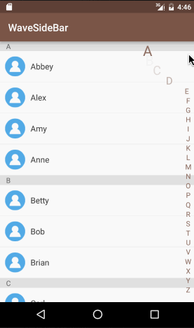
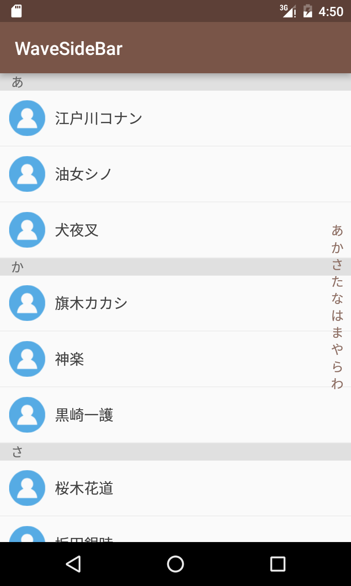
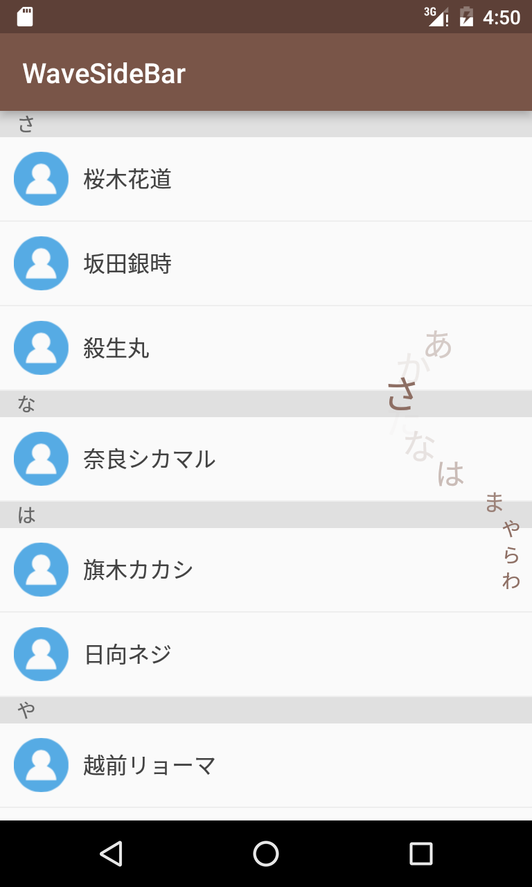
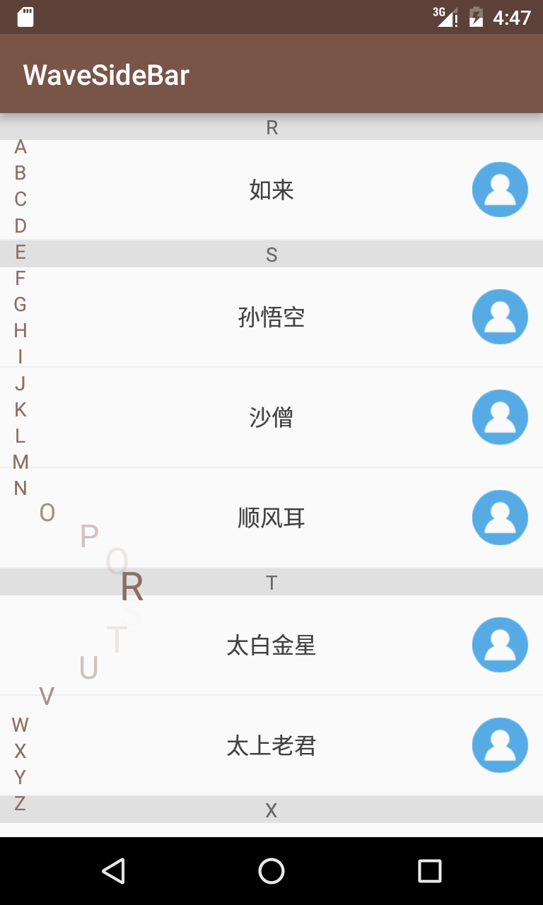
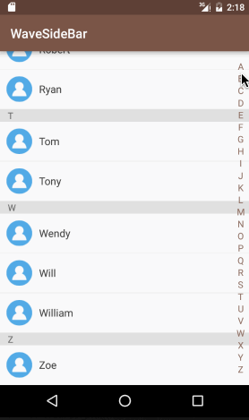

# WaveSideBar

You can use WaveSideBar in the contacts page of your application.  
Refer to [AlexLiuSheng/AnimSideBar](https://github.com/AlexLiuSheng/AnimSideBar).

## Screenshot


## Include the WaveSideBar to Your Project
With gradle:

```groovy
dependencies {
   compile 'com.gjiazhe:wavesidebar:1.0.2'
}
```

## Use WaveSideBar in Layout File
```xml
<com.gjiazhe.wavesidebar.WaveSideBar
        android:id="@+id/side_bar"
        android:layout_width="match_parent"
        android:layout_height="match_parent"
        android:paddingRight="8dp"
        app:sidebar_position="right"
        app:sidebar_max_offset="80dp"
        app:sidebar_lazy_respond="false"
        app:sidebar_text_color="#8D6E63"/>
```

## Description of Attributes
|      Attributes      |       Format       |  Default   |               Description                |
| :------------------: | :----------------: | :--------: | :--------------------------------------: |
|  sidebar_text_color  |       color        | Color.GRAY |                text color                |
|  sidebar_max_offset  |     dimension      |    80dp    |       offset of the selected item        |
|   sidebar_position   | enum [right, left] |   right    |  be placed on left or right in the view  |
| sidebar_lazy_respond |      boolean       |   false    | If __true__, the listener will not be called until the finger __up__. If __false__, the listener will be called when the finger __down__, __move__ and __up__. |

You can set these attributes in the layout file, or in the java code:
```java
WaveSideBar sideBar = (WaveSideBar) findViewById(R.id.side_bar);
sideBar.setTextColor(Color.BLACK);
sideBar.setMaxOffset(100);
sideBar.setPosition(WaveSideBar.POSITION_LEFT);
sideBar.setLazyRespond(true);
```

## Set the Listener to Observe WaveSideBar
```java
WaveSideBar sideBar = (WaveSideBar) findViewById(R.id.side_bar);
sideBar.setOnSelectIndexItemListener(new WaveSideBar.OnSelectIndexItemListener() {
    @Override
    public void onSelectIndexItem(String index) {
        Log.d("WaveSideBar", index);
        // Do something here ....
    }
});
```

## Customize the indexes
Use **setIndexItems** to Customize the indexes.
```java
sideBar.setIndexItems("あ", "か", "さ", "た", "な", "は", "ま", "や", "ら", "わ");
```




## Use Left Hand?
Use **setPosition** to change the position of side bar.
```java
sideBar.setPosition(WaveSideBar.POSITION_LEFT);
```



## Lazy respond
use **setLazyRespond** to set whether the side bar should respond lazily to your touch events. 
```java
sideBar.setLazyRespond(true);
```

